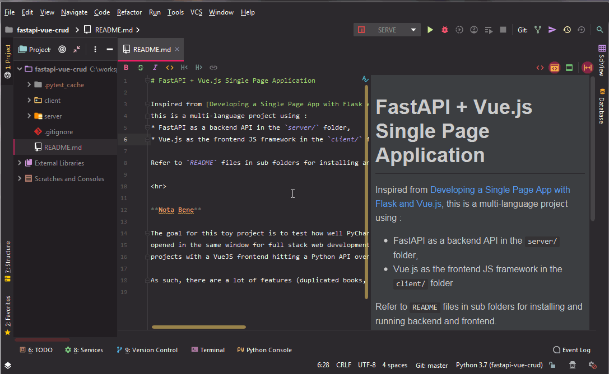

# FastAPI + Vue.js Single Page Application

Inspired from [Developing a Single Page App with Flask and Vue.js](https://github.com/testdrivenio/flask-vue-crud),
this is a multi-language project using :
* FastAPI as a backend API in the `server/` folder,
* Vue.js as the frontend JS framework in the `client/` folder

Refer to `README` files in sub folders for installing and running backend and frontend.

**Nota Bene**

The goal for this toy project is to test how well PyCharm Ultimate responds to a Python/Vue.js project 
opened in the same window for full stack web development. Want to use this as an example for later 
projects with a VueJS frontend hitting a Python API over a ML model.

As such, there are a lot of features (duplicated books, authentication, all JS unit tests) I did not implement :)
